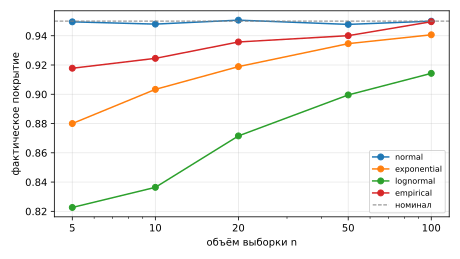

# T2. Конвейер «эксперимент → артефакт → страница»

Как результаты вычислений попадают на страницы сайта, где эти вычисления выполнять — в CI или
отдельно — и как в последнем случае не потерять связь опубликованной цифры с кодом и данными.

## Эксперимент

Все способы сравниваются на одном эксперименте. Методом Монте-Карло оценивается **фактическое
покрытие 95 %-го доверительного t-интервала** для среднего: какая доля интервалов
$\bar{x} \pm t_{1-\alpha/2,\,n-1}\, s/\sqrt{n}$ накрывает истинное среднее. Выборки берутся из
четырёх распределений, объём выборки $n$ — от 5 до 100, по 20 000 повторений в каждой ячейке.
Распределение `empirical` — выборка с возвращением из датасета `data/measurements.csv`
(версия 1.0, 500 значений). Он нужен, чтобы в эксперименте были не только код и параметры,
но и внешние данные.

Ниже — опубликованный результат. Таблица, рисунок и сводка о происхождении не набраны вручную, а
вставлены из файлов, которые сгенерировал скрипт (подробнее — в разделе
[«Стратегия 2 на этом сайте»](#strategy2)).

### Фактическое покрытие

--8<-- "t2/results/coverage.md"



Для нормального распределения покрытие держится у номинала 0,95 при любом $n$. Для асимметричных
распределений t-интервал при малых выборках накрывает истинное среднее заметно реже заявленного:
у логнормального при $n=5$ покрытие около 0,82. Расхождение уменьшается с ростом $n$, как и
предсказывает центральная предельная теорема.

### Происхождение результата

--8<-- "t2/results/provenance.md"

Полные метаданные запуска — в [manifest.json](results/manifest.json), исходные числа — в
[coverage.csv](results/coverage.csv).

## Пять способов доставки результата

Каждый способ реализован на этом эксперименте. Код лежит в
[`research/t2`](https://github.com/crasavella04/python-lab3/tree/main/research/t2), замеры — в
`bench_pipelines.py` и `pipelines.json`.

| | Способ | Где идут вычисления | Что попадает в репозиторий |
|---|---|---|---|
| A | Статическое изображение, сохранённое вручную | на машине автора | PNG |
| B | `nbconvert --execute` → HTML или Markdown | при сборке | ноутбук без выводов |
| C | MyST-NB: исполнение ноутбуков при сборке Sphinx | при сборке, с кэшем | ноутбук без выводов |
| D | `papermill` → исполненные ноутбуки → `nbconvert` | где запущен papermill | ноутбук-шаблон (исполненные — по выбору) |
| E | Скрипт генерирует CSV, Markdown, SVG и манифест; вызывается из `nox` | где запущен скрипт | код и сгенерированные файлы с манифестом |

**Quarto** не проверялся: он распространяется как отдельный бинарный пакет, а не через PyPI, и на
машине не установлен. По устройству он ближе всего к C. `quarto render` исполняет `.qmd` и `.ipynb`
через Jupyter, кэширует результат (`freeze: auto` хранит выводы в каталоге `_freeze`, который
коммитится), принимает параметры, как papermill. Режим `freeze` при этом — готовый механизм
стратегии 2: вычисления выполняются локально, а CI собирает сайт из закоммиченного `_freeze`.

### Замеры

Windows 11, Python 3.13. Время — полное время команды, как его видит CI.

| Способ | Время | Объём результата |
|---|---|---|
| A. Ручное PNG | 8,6 с | 56 КБ, 1 файл |
| B. nbconvert → HTML | 17,3 с | 334 КБ (картинки встроены в base64) |
| B. nbconvert → Markdown | 15,7 с | 39 КБ: `.md` и PNG |
| C. MyST-NB, холодная сборка | 26,1 с | сайт 285 КБ, кэш 134 КБ |
| C. MyST-NB, пересборка из кэша | **9,3 с** | — |
| C. MyST-NB, после смены параметра | 26,2 с | — |
| D. papermill, n_sim = 2 000 / 20 000 / 200 000 | 18,1 / 15,7 / 20,9 с | исполненный ноутбук ≈ 57 КБ |
| E. Скрипт напрямую | 8,8 с | 49 КБ: 5 файлов |
| E. Скрипт через nox, первый запуск / повторный | 11,3 / 9,0 с | — |

Сам расчёт занимает **0,6 с**. Остальное время уходит на накладные расходы: импорт numpy, pandas,
scipy и matplotlib на этой машине занимает 7,5–8 с, запуск ядра Jupyter добавляет ещё 7 с, Sphinx
вместе с ядром — 17 с. Отсюда два вывода:

1. Для лёгких вычислений способ выбирают по удобству и воспроизводимости, а не по скорости:
   разница в секундах.
2. Кэш MyST-NB работает: без изменений ноутбук не исполняется заново (9,3 с против 26,1 с). Но
   любая правка ячейки, даже смена `n_sim` на единицу, сбрасывает кэш этого ноутбука целиком.
   Ключ кэша — хеш кода ячеек. Изменение **данных** этот хеш не меняет, поэтому после правки
   датасета кэш выдаст устаревший результат.

Масштабирование видно по papermill: рост `n_sim` в 100 раз (с 2 000 до 200 000) добавил около 3 с.
Это сравнимо с разбросом между запусками (15,7 с при 20 000 против 18,1 с при 2 000), так что точнее
здесь не измерить. Именно эта, растущая с объёмом вычислений, часть и упирается в лимиты CI.

### Сравнение

| Критерий | A. Вручную | B. nbconvert | C. MyST-NB | D. papermill | E. Скрипт + nox |
|---|---|---|---|---|---|
| Результат соответствует коду | не гарантировано | да, если исполнять в CI | да, если исполнять в CI | да, в момент запуска | да, проверяется по манифесту |
| Параметризация запусков | нет | нет | нет | **да** (`-p n_sim 200000`) | да, аргументы скрипта |
| Кэш | — | нет | **да**, по хешу ячеек | нет | по манифесту: можно не пересчитывать |
| Зависимости для сборки сайта | никаких | ядро Jupyter и все пакеты эксперимента | Sphinx, ядро и пакеты | Jupyter и пакеты | **никаких** (проверка — только stdlib) |
| Читаемость diff в Git | бинарный PNG | ноутбук JSON | ноутбук JSON | JSON с выводами | CSV, Markdown, SVG, JSON — текст |
| Генерирует таблицы для страницы | нет | ячейки как есть | ячейки как есть | ячейки как есть | **да**, Markdown-таблица |

Ловушки, найденные при реализации:

- **Рисунок пропал из Markdown.** Если в окружении задано `MPLBACKEND=Agg`, ядро ноутбука не
  выводит графики: nbconvert сохранил Markdown без единого PNG, и ошибки при этом не было.
- **Рисунок попал в результат дважды.** Ячейка `fig = plot(df)` с выражением `fig` в конце: график
  выводит и inline-бэкенд matplotlib, и само выражение. nbconvert сохранил два одинаковых PNG.
- **papermill не создаёт каталог для результата**, а падает с `output folder ... doesn't exist`.
- **SVG от matplotlib по умолчанию не воспроизводим**: в файл пишутся дата и случайные
  идентификаторы, и хеш меняется при каждом запуске. Для манифеста это критично. Помогли
  `savefig(..., metadata={"Date": None})` и `rcParams["svg.hashsalt"]`. После этого два запуска
  дают байт в байт одинаковые CSV, Markdown и SVG.

## Ограничения CI для тяжёлых вычислений

Лимиты GitHub Actions по документации GitHub на октябрь 2026 года:

| Ограничение | Значение | Что это значит для вычислений |
|---|---|---|
| Время одного job на хостинговом раннере | **6 ч** | расчёт дольше 6 ч в CI невозможен в принципе |
| Время всего workflow | 35 дней | — |
| Минуты для приватных репозиториев (Free) | 2 000 в месяц; публичные — бесплатно | 20-минутный расчёт при каждом push исчерпает лимит за 100 push |
| Раннер `ubuntu-latest`, публичный репозиторий | 4 CPU, 16 ГБ RAM, 14 ГБ SSD | данные и промежуточные файлы должны помещаться в 14 ГБ |
| Раннер для приватного репозитория | 2 CPU, 8 ГБ RAM, 14 ГБ SSD | вдвое слабее |
| GPU | **нет** на стандартных раннерах; только «большие» платные раннеры (планы Team и Enterprise) | обучение нейросетей в бесплатном CI исключено |
| Кэш | 10 ГБ на репозиторий; записи без обращений дольше 7 дней удаляются | при редких push кэш вычислений пропадает — нужен запасной путь |
| Хранилище артефактов (Free) | 500 МБ, вместе с Packages | исполненные ноутбуки и сырые результаты быстро его заполнят |
| Артефакт Pages | официально до 1 ГБ (жёсткий предел 10 ГБ); хранится 1 день по умолчанию | — |
| Опубликованный сайт Pages | до 1 ГБ; деплой прерывается через 10 мин | большие наборы данных на сайт не выложить |
| Параллельность | 20 одновременных job (Free); матрица — до 256 job | параметрический перебор можно распараллелить, но в пределах лимитов |
| Файл в Git | GitHub блокирует файлы больше 100 МБ | большие результаты хранить в Git LFS или вне репозитория |

Кроме лимитов:
- CI-раннер — чистая машина. Каждый запуск заново ставит пакеты, а в нашем случае ещё 8 с уходит
  на импорты.
- Секреты и закрытые данные (персональные, под NDA) нельзя тянуть в публичный CI.
- Расчёт в CI задерживает публикацию: правка опечатки в тексте ждёт, пока пересчитается эксперимент.

## Граница между стратегиями

**Стратегия 1 — вычисления в CI.** Сайт собирается из кода и данных, результаты пересчитываются
при сборке (способы B, C, D в CI). **Стратегия 2 — вычисления отдельно.** Расчёт выполняется на
машине автора, сервере или кластере, а CI собирает сайт из готовых артефактов (способы A, E,
Quarto `freeze`).

Вычисления **можно оставить в CI**, только если выполнены все условия:

1. **Время.** Расчёт укладывается в несколько минут, а не в 6 часов: он повторяется при каждом push и
   задерживает публикацию. Практический порог — около 10 минут на сборку.
2. **Ресурсы.** Хватает CPU: GPU нет. Нужно не больше 16 ГБ памяти и 14 ГБ диска.
3. **Данные.** Входные данные публичны, малы (до сотен мегабайт) и воспроизводимо скачиваются
   по фиксированной версии. Секретов нет.
4. **Детерминированность.** При одинаковых коде, данных и `seed` расчёт даёт одинаковый результат.
   Иначе каждая сборка будет публиковать другие числа.
5. **Не нужна проверка человеком.** Результат можно публиковать сразу, без просмотра автором.

Если не выполнено хотя бы одно условие — GPU, часы расчёта, закрытые или большие данные,
недетерминированный дорогой запуск, результат требует проверки перед публикацией — нужна
**стратегия 2**.

**Промежуточный вариант** — исполнение в CI с кэшем: MyST-NB с jupyter-cache, Quarto `freeze` или
`actions/cache` с ключом `hashFiles('experiment/**', 'data/**')`. Он экономит время на сборках без
изменений, но не снимает ограничений по GPU, 6 часам и данным. Кэш живёт 7 дней без обращений,
поэтому сборка без кэша всё равно должна укладываться в лимиты. Кэш MyST-NB к тому же не видит
изменений данных.

Наш эксперимент (0,6 с расчёта, CPU, 500 строк публичных данных, фиксированный `seed`) проходит
все пять условий, и его можно было бы считать в CI. Стратегия 2 реализована на нём, чтобы
показать механизм, который понадобится, когда расчёт перестанет проходить хотя бы одно условие.

## Стратегия 2: как сохранить связь с кодом и данными {#strategy2}

Главный риск стратегии 2 — опубликованная цифра расходится с кодом в репозитории. Код поправили,
а результаты не пересчитали; датасет обновили, а на сайте старые числа; таблицу подправили
руками. Против этого результат сопровождается **манифестом**, а CI его проверяет.

### Что фиксирует манифест

| Поле | Содержание | Зачем |
|---|---|---|
| `git.commit`, `git.dirty` | коммит кода и признак незакоммиченных правок в коде и данных | по коммиту можно восстановить код; `dirty` означает, что код восстановить нельзя |
| `code.files`, `code.sha256` | SHA-256 каждого файла кода эксперимента и общий хеш | обнаружить правку кода без пересчёта |
| `data.version`, `data.sha256` | версия и хеш датасета из паспорта `data/DATASET.json` | обнаружить подмену данных и смену версии |
| `params`, `params_sha256` | параметры запуска (`n_sim`, `seed`, `alpha`, сетка) | повторить запуск точно |
| `env` | версии Python, numpy, scipy, pandas, matplotlib, платформа | объяснить расхождения на другой машине |
| `run` | время запуска и длительность расчёта | — |
| `outputs` | SHA-256 каждого файла результата | обнаружить ручную правку результатов |

Хеши текстовых файлов считаются с нормализацией переводов строк, поэтому совпадают на Windows и
Linux. У датасета есть **паспорт** `DATASET.json`: файл, версия, SHA-256, число строк, источник.
Изменить данные, не выпустив новую версию, нельзя: проверка заметит расхождение файла с паспортом.

### Порядок работы

```bash
git commit -m "код эксперимента"              # 1. сначала код и данные
nox -s results                                 # 2. расчёт → docs/t2/results + manifest.json
git add docs/t2/results && git commit -m "результаты"   # 3. результаты отдельным коммитом
git push                                       # 4. CI: проверка манифеста → сборка → деплой
```

В CI перед сборкой выполняется `python research/t2/provenance.py check docs/t2/results`. Скрипт
использует только стандартную библиотеку, поэтому CI не ставит numpy и не тратит 8 секунд на
импорты. Если проверка не прошла, сайт не собирается и устаревшие результаты не публикуются.

### Проверка на практике

Проверка запускалась на копии проекта, в которую по очереди вносились нарушения:

| Сценарий | Результат `provenance.py check` |
|---|---|
| Ничего не менялось | `OK результаты соответствуют текущему коду, параметрам и данным` |
| В коде изменили `alpha` 0.05 → 0.10, не пересчитав | `FAIL код изменён после расчёта: experiment/coverage.py` |
| В датасете поменяли одно значение, версию не меняли | `FAIL файл данных не совпадает с паспортом data/DATASET.json` |
| Выпустили датасет v1.1, результаты не пересчитали | `FAIL результаты посчитаны на другой версии данных: 1.0 → 1.1` |
| В таблице результатов вручную исправили 0.823 → 0.950 | `FAIL файл результата изменён вручную: coverage.md` |
| Расчёт на незакоммиченном коде | `FAIL расчёт выполнен на незакоммиченном коде (git dirty)` |

Последний случай произошёл сам при первом запуске: результаты были посчитаны до коммита кода.

### Что можно усилить

- **Большие датасеты** — хранить вне Git (DVC, Git LFS, объектное хранилище) и фиксировать в
  паспорте адрес и хеш. DVC делает это сам: `dvc.lock` хранит MD5 входов и выходов каждого шага.
- **Окружение** — фиксировать не версии нескольких пакетов, а хеш lock-файла (`uv.lock`,
  `requirements.txt`) или digest Docker-образа, в котором шёл расчёт.
- **Публикация набора результатов** — привязывать к Git-тегу или GitHub Release, для научной
  публикации — получать DOI в Zenodo. Тогда ссылка на результат не изменится при пересчёте.
- **Недетерминированные вычисления** (GPU, параллельные редукции) — побайтового совпадения не будет.
  Тогда в манифест пишут `seed` и допуск, а сравнивают числа с допуском, а не хеши.
